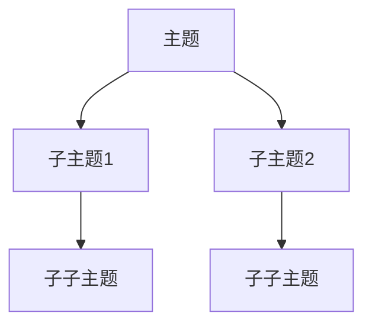

# Markdown 语言范例

<!-- @import "[TOC]" {cmd="toc" depthFrom=1 depthTo=6 orderedList=false} -->

<!-- code_chunk_output -->

- [Markdown 语言范例](#markdown-语言范例)
  - [标题](#标题)
  - [列表](#列表)
  - [强调](#强调)
  - [链接与图片](#链接与图片)
  - [引用](#引用)
  - [代码](#代码)
  - [分割线](#分割线)
  - [表格](#表格)
  - [任务列表](#任务列表)
  - [脚注](#脚注)
  - [思维导图制作方法](#思维导图制作方法)

<!-- /code_chunk_output -->

---

## 标题

Markdown 可以通过添加不同数量的`#`来创建标题。例如：

```
# 一级标题
## 二级标题
### 三级标题
```

## 列表

有序列表和无序列表可以通过`1.`和`-`来创建：

- 无序列表项 1
- 无序列表项 2

1. 有序列表项 1
   1. 有序列表 1.1
2. 有序列表项 2、

## 强调

使用`*`或`_`来添加强调效果：

_斜体_
_斜体_

**粗体**
**粗体**

## 链接与图片

创建链接和插入图片：

[链接文本](链接URL)


## 引用

引用他人的内容可以使用`>`：

> 这是引用的内容。

## 代码

插入行内代码使用\`代码内容\`，插入代码块使用三个反引号：

```python
def hello_world():
    print("Hello, world!")
```

## 分割线

使用三个或更多的`-`、`*`或`_`来创建分割线：

---

## 表格

创建表格使用`|`分隔单元格，以及`-`分隔表头和表格内容：

| 列 1   | 列 2   |
| ------ | ------ |
| 内容 1 | 内容 2 |
| 内容 3 | 内容 4 |

## 任务列表

创建任务列表可以使用`- [ ]`和`- [x]`：

- [ ] 未完成任务
- [x] 已完成任务

## 脚注

创建脚注以供参考：

这是一个脚注[^1]。

[^1]: 这是脚注的内容。

## 思维导图制作方法

你可以使用 Mermaid 来创建思维导图，它是一个支持 Markdown 的绘图工具。在你的 Markdown 文档中，使用下面的代码来创建一个简单的思维导图：



将上述代码粘贴到 Markdown 文档中，Mermaid 会将其渲染为一个思维导图。

请注意，不同的 Markdown 编辑器和平台对 Mermaid 的支持可能有所不同。在某些地方，你可能需要启用 Mermaid 支持或使用插件。
