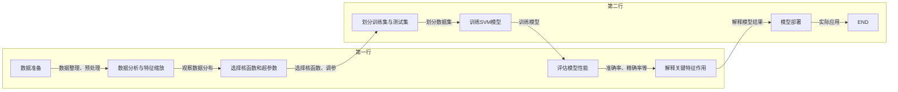
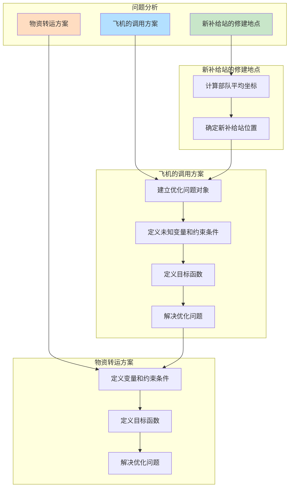

```mermaid
flowchart LR
subgraph 第一行
A[数据准备] -->|数据整理、预处理| B[数据分析与特征缩放]
B -->|观察数据分布| C[选择核函数和超参数]
end

subgraph 第二行
C -->|选择核函数、调参| D[划分训练集与测试集]
D -->|划分数据集| E[训练SVM模型]
end

subgraph 第一行
E -->|训练模型| F[评估模型性能]
F -->|准确率、精确率等| G[解释关键特征作用]
end

subgraph 第二行
G -->|解释模型结果| H[模型部署]
H -->|实际应用| END
end
```

```mermaid
graph TD
    subgraph "问题分析"
        A[新补给站的修建地点]
        B[飞机的调用方案]
        C[物资转运方案]
    end

    subgraph "新补给站的修建地点"
        A --> A1[计算部队平均坐标]
        A1 --> A2[确定新补给站位置]
    end

    subgraph "飞机的调用方案"
        B --> B1[建立优化问题对象]
        B1 --> B2[定义未知变量和约束条件]
        B2 --> B3[定义目标函数]
        B3 --> B4[解决优化问题]
    end

    subgraph "物资转运方案"
        C --> C1[定义变量和约束条件]
        C1 --> C2[定义目标函数]
        C2 --> C3[解决优化问题]
    end

    A2 --> B1
    B4 --> C1

    style A fill:#c8e6c9
    style B fill:#b3e0ff
    style C fill:#ffddc1
```

